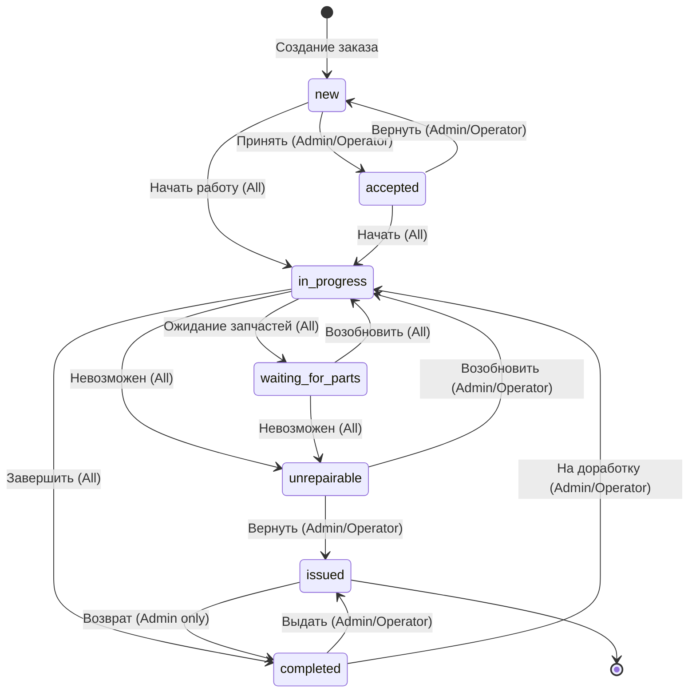

# 📊 Order State Machine

**Дата:** 3 марта 2026  
**Статус:** ✅ Реализовано

---

## 🎯 Назначение

State Machine определяет **разрешённые переходы** статусов заказа и **бизнес-правила** для каждого перехода.

---

## 📋 Диаграмма состояний



---

## 🔄 Таблица переходов

| Откуда | Куда | Роли | Требования |
|--------|------|------|------------|
| `new` | `accepted` | Admin, Operator | Мастер назначен |
| `new` | `in_progress` | All | Мастер назначен |
| `accepted` | `in_progress` | All | Цена согласована |
| `accepted` | `new` | Admin, Operator | - |
| `in_progress` | `waiting_for_parts` | All | Указаны запчасти |
| `in_progress` | `completed` | All | Работа выполнена, цена установлена |
| `in_progress` | `unrepairable` | All | Указана причина |
| `waiting_for_parts` | `in_progress` | All | Запчасти получены |
| `waiting_for_parts` | `unrepairable` | All | - |
| `completed` | `issued` | Admin, Operator | Оплата подтверждена |
| `completed` | `in_progress` | Admin, Operator | - |
| `unrepairable` | `issued` | Admin, Operator | Клиент уведомлён |
| `unrepairable` | `in_progress` | Admin, Operator | - |
| `issued` | `completed` | Admin | Возврат/рекламация |

---

## 🔒 Проверка прав доступа

### Примеры использования

**Backend (orders.service.ts):**

```typescript
import { canTransition, validateTransitionRequirements } from './order-state-machine';

async updateOrder(id: string, dto: any, userId: string, userRole: OrderRole) {
    const order = await this.orderRepo.findOne({ where: { id } });
    
    if (dto.status) {
        // 1. Проверка перехода
        const transition = canTransition(order.status, dto.status, userRole);
        
        if (!transition.allowed) {
            throw new ForbiddenException(transition.reason);
            // Пример: "Переход из 'new' в 'issued' запрещён"
        }
        
        // 2. Проверка требований
        const requirements = validateTransitionRequirements(
            { from: order.status, to: dto.status, allowedRoles: [], description: '' },
            {
                master_id: null,
                price_approved_at: null,
                total_price_uzs: order.total_price_uzs,
                total_paid_uzs: order.total_paid_uzs,
            }
        );
        
        if (!requirements.valid) {
            throw new BadRequestException({
                message: 'Требования перехода не выполнены',
                missingRequirements: requirements.missingRequirements,
            });
            // Пример: ["Цена должна быть согласована с клиентом"]
        }
        
        order.status = dto.status;
        await this.orderRepo.save(order);
    }
}
```

**Frontend (orders/[id]/page.tsx):**

```typescript
import { getAvailableTransitions } from '@/lib/order-state-machine';

// Получить доступные кнопки статусов
const availableTransitions = getAvailableTransitions(
    order.status, 
    user.role
);

// Рендер кнопок
{availableTransitions.map(transition => (
    <button
        key={transition.to}
        onClick={() => handleStatusChange(transition.to)}
    >
        {transition.description}
    </button>
))}
```

---

## ✅ Валидация требований

### Стандартные требования

| Требование | Проверка |
|------------|----------|
| "Мастер назначен" | `order.master_id !== null` |
| "Цена согласована" | `order.price_approved_at !== null` |
| "Цена установлена" | `order.total_price_uzs > 0` |
| "Оплата подтверждена" | `order.total_paid_uzs >= order.total_price_uzs` |
| "Клиент уведомлён" | `notification.sent === true` |

---

## 📝 Аудит и логирование

Каждый переход записывается в `order_lifecycle`:

```typescript
await this.addLifecycle(
    orderId,
    null,
    `Статус изменён с "${oldStatus}" на "${newStatus}"`,
    0,
    userId
);
```

**Пример записи:**
```json
{
    "id": "uuid",
    "order_id": "uuid",
    "comments": "Статус изменён с 'in_progress' на 'completed'",
    "is_completed": 1,
    "created_by": "user-id",
    "created_at": "2026-03-03T17:00:00Z"
}
```

---

## 🎨 UI Интеграция

### Цвета статусов

```typescript
const statusColors: Record<OrderStatus, string> = {
    new: 'purple',
    accepted: 'blue',
    in_progress: 'yellow',
    waiting_for_parts: 'orange',
    completed: 'green',
    unrepairable: 'red',
    issued: 'emerald',
};
```

### Описания для UI

```typescript
const statusDescriptions: Record<OrderStatus, string> = {
    new: 'Новый заказ, ожидает принятия',
    accepted: 'Принят в работу, ожидает начала выполнения',
    in_progress: 'В процессе выполнения работ',
    waiting_for_parts: 'Ожидание необходимых запчастей',
    completed: 'Ремонт завершён, готов к выдаче',
    unrepairable: 'Ремонт невозможен',
    issued: 'Выдан клиенту',
};
```

---

## 🔧 Расширение

### Добавление нового перехода

1. Откройте `order-state-machine.ts`
2. Добавьте запись в `STATE_TRANSITIONS`:

```typescript
{
    from: 'completed',
    to: 'in_progress',
    allowedRoles: ['admin', 'operator'],
    description: 'Вернуть на доработку',
    requirements: ['Указана причина возврата'],
}
```

3. При необходимости обновите `validateTransitionRequirements`
4. Протестируйте переход

---

## 📊 Метрики

State Machine позволяет отслеживать:

- **Среднее время** на каждом статусе
- **Частые переходы** (где застревают заказы)
- **Нарушения** (попытки недопустимых переходов)
- **SLA** по времени выполнения

---

## 🧪 Тестирование

```typescript
import { canTransition, getAvailableTransitions } from './order-state-machine';

describe('Order State Machine', () => {
    it('should allow new -> accepted for admin', () => {
        const result = canTransition('new', 'accepted', 'admin');
        expect(result.allowed).toBe(true);
    });
    
    it('should not allow new -> issued', () => {
        const result = canTransition('new', 'issued', 'admin');
        expect(result.allowed).toBe(false);
    });
    
    it('should not allow client to change status', () => {
        const result = canTransition('new', 'accepted', 'client');
        expect(result.allowed).toBe(false);
    });
    
    it('should get available transitions for status', () => {
        const transitions = getAvailableTransitions('in_progress', 'master');
        expect(transitions.length).toBeGreaterThan(0);
    });
});
```

---

## 📚 Связанные файлы

- [`apps/api/src/modules/orders/order-state-machine.ts`](../apps/api/src/modules/orders/order-state-machine.ts) - основная логика
- [`apps/api/src/modules/orders/orders.service.ts`](../apps/api/src/modules/orders/orders.service.ts) - интеграция
- [`apps/api/src/modules/orders/orders.controller.ts`](../apps/api/src/modules/orders/orders.controller.ts) - API endpoints

---

**Обновлено:** 3 марта 2026  
**Версия:** 1.0
